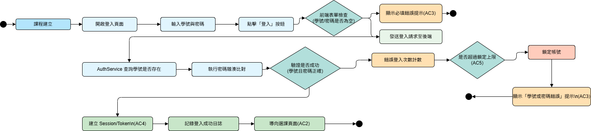

# **選課系統設計文件 (Design Document)：登入系統身分驗證**

**文件版本:** V1.0  
**日期:** 2025/12/07
**文件對應:** 本設計文件對應 S4
**專案作者：** 施穎禾, B1243021

## **1\. 細部系統架構 (Detailed System Architecture)**

本登入模組採用 **分層式架構 (Layered Architecture)**，核心在於 **身份驗證服務 (Authentication Service)**，並特別強調安全性與 Token/Session 管理。

### **1.1 架構分層設計**

| 分層 (Layer) | 元件名稱 | 職責描述 | 技術選型範例 |
| :---- | :---- | :---- | :---- |
| **表現層 (Presentation)** | **Login UI** | 負責登入表單的渲染、前端輸入檢查 (AC3)，發送登入請求。 | React / Vue.js |
| **API 閘道層 (Controller)** | **AuthController** | 接收學號/密碼 (HTTP POST)，執行基本參數檢核，並轉發至服務層。 | Spring Boot Web / Express |
| **業務邏輯層 (Service)** | **AuthService** | **核心層**。執行密碼雜湊比對、錯誤登入計數/鎖定邏輯 (AC5)，並生成 Session/Token (AC4)。 | Java / Node.js |
| **資料存取層 (Repository)** | **StudentRepo** | 負責讀取資料庫中學生的**學號**與**加密密碼**。 | JPA / Hibernate / Sequelize |
| **資料儲存層 (Database)** | **PostgreSQL/MySQL** | 儲存學生帳號資料，密碼需使用 bcrypt/Argon2 雜湊儲存 (NFR 4.1.1)。 | PostgreSQL (推薦) |

### **1.2 核心安全機制**

1.  **密碼儲存:** 密碼必須使用加鹽 (Salted) 的雜湊演算法儲存，確保即使資料庫外洩，密碼也不可逆讀取。
2.  **暴力破解防護 (AC5):** 登入失敗時，系統應記錄失敗 IP 或學號，超過 5 次失敗則暫時鎖定帳號（例如 30 分鐘）。
3.  **Session/Token:** 登入成功後，發放 JWT (JSON Web Token) 或 Session ID，並設置 `HttpOnly` 及 `Secure` 屬性 Cookie，以防 XSS 攻擊 (NFR 4.1.4)。

## **2\. 重要功能的系統塑模 (System Modeling)**

本節針對需求文件中定義的 **T1 (輸入與驗證)** 與 **T2 (成功導向)** 進行邏輯建模。

### **2.1 活動圖 (Activity Diagram)**

**描述:** 說明「學生登入與身份驗證」的完整流程。對應需求 AC1, AC2, AC3。

### **2.2 循序圖 (Sequence Diagram)**

**描述:** 說明「身份驗證成功並建立授權」的互動流程。對應需求 AC2, AC4, T2。

### **2.3 狀態圖 (State Diagram)**

**描述:** 描述一個**使用者身份**在系統中的生命週期狀態變化。

## **3\. 資料庫設計 (Database Design)**

為了滿足 **AC1** 的身份驗證與 **NFR 4.1.1** 的安全性要求，資料庫設計如下。

### **3.1 實體關聯圖 (ER Diagram 概念)**

* **Students (學生表):** 儲存登入所需的學號、姓名、加密密碼。
* **Security_Log (安全日誌表):** 儲存登入失敗的嘗試，用於防護暴力破解 (AC5)。

### **3.2 資料表結構 (Schema)**

Table: Students  
| 欄位名 | 類型 | 描述 | 備註 |
| :--- | :--- | :--- | :--- |
| student\_id | VARCHAR(10) | 學號 | PK, 用於 AC1 |
| full\_name | VARCHAR(50) | 學生姓名 | |
| password\_hash | VARCHAR(255) | 加鹽的加密密碼 | NFR 4.1.1 密碼儲存標準 |
| salt | VARCHAR(64) | 密碼雜湊使用的 Salt | |
| last\_login\_at | TIMESTAMP | 上次登入時間 | |

Table: Security\_Log
| 欄位名 | 類型 | 描述 | 備註 |
| :--- | :--- | :--- | :--- |
| id | BIGINT | 日誌 ID | PK |
| student\_id | VARCHAR(10) | 嘗試登入學號 | |
| attempted\_at | TIMESTAMP | 嘗試登入時間 | |
| result | VARCHAR(10) | 嘗試結果 | SUCCESS / FAILURE |
| source\_ip | VARCHAR(40) | 來源 IP | NFR 4.3.2 稽核與 AC5 鎖定機制 |