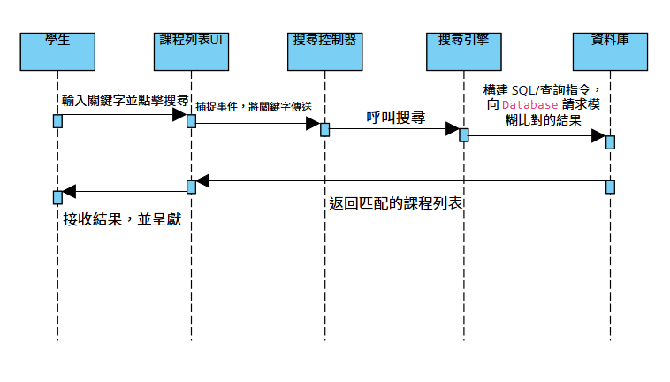

# 📐 系統設計文件 (Design Document) - Story 5：課程瀏覽與高效搜尋 (1.0V)

## 1. 文件概覽 (Document Summary)

本文件描述了「課程瀏覽與高效搜尋」功能的設計細節，包含系統的核心靜態結構和動態流程。

| 項目 | 描述 |
| :--- | :--- |
| **文件標題** | Story 5：課程瀏覽與高效搜尋系統設計 |
| **文件版本** | V1.0 (設計初始版本) |
| **設計目標** | 確保課程列表的資料結構清晰，並定義多條件查詢和篩選的內部運作流程。 |

---

## 2. 系統架構圖與元件 (System Architecture & Components)

### 2.1 類別圖 (Class Diagram) 說明

類別圖定義了系統的**靜態結構**，即主要資料實體和邏輯組件的關係。它展示了 `Course`、`Student` 和 `SearchEngine` 之間的關聯性、屬性與操作。

* **核心組件：** `Course` (課程資料)、`SearchEngine` (負責查詢邏輯)。
* **關係：** 學生 (`Student`) 使用 `CourseList` 進行瀏覽，並透過 `SearchEngine` 執行複雜查詢。

### 2.2 活動圖 (Activity Diagram) 說明

活動圖描述了 **學生執行一次查詢操作** 的完整工作流程，使用**泳道**來區分學生和系統的責任，確保所有搜尋和篩選功能都被涵蓋。

* **流程重點：** 涵蓋了從載入列表到決策是否使用**萬用搜尋** (FR-S5.3)、**時間區段搜尋** (FR-S5.4) 和 **屬性篩選** (FR-S5.5) 的所有路徑。
* **圖像解釋：** 描繪了學生查詢時，從啟動、排序、搜尋到篩選（多個決策分支）的完整流程路徑。

### 2.3 循序圖 (Sequence Diagram) 說明

循序圖描述了 **系統在執行關鍵字搜尋 (FR-S5.3) 時** 的動態交互過程，強調訊息傳遞的時序性。

* **參與者：** 學生 (Student)、介面 (UI)、控制器 (Controller)、搜尋引擎 (Engine)、資料庫 (DB)。
* **重點驗證：** 確保查詢操作的流程正確、效率高，並由 `SearchEngine` 負責處理資料庫的模糊比對。

---
